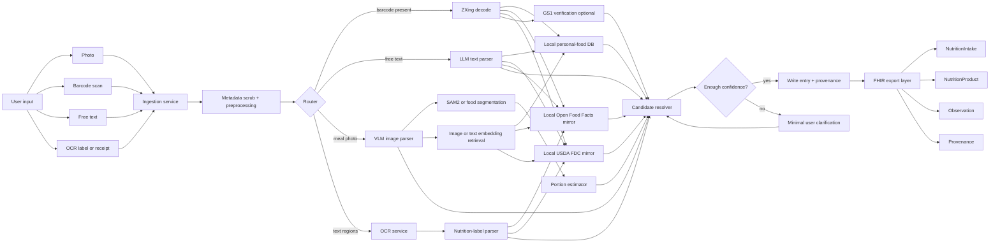
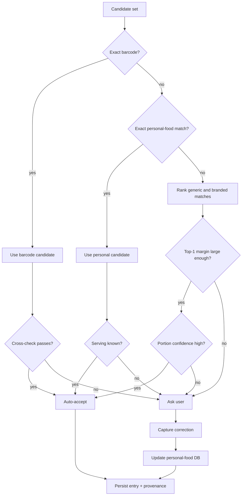

# On-Premises Calorie Tracking for a Medical and Activity Data Ecosystem

## Executive summary

The strongest design is not a single “AI food logger.” It is a **source-ranked hybrid system** that separates **recognition** from **nutrition resolution**. In practice, the most convenient and accurate path depends on the logging context. For packaged foods, the pipeline should go **barcode first**, then resolve against a **local mirror of branded-food datasets** and the user’s own confirmed-food history; for repeated meals or snacks, the **personal food database** should be the first stop; for mixed meals and homemade dishes, the best approach is a **multimodal image pipeline** that combines a vision-language model, optional food segmentation, and a portion estimator; free-text logging should go through a **local LLM parser that emits strict JSON**; OCR and web search should be **supporting fallbacks**, not primary truth sources. This architecture uses the most deterministic sources when available and reserves generative inference for the genuinely ambiguous cases. citeturn26view0turn25view2turn10search0turn10search1turn5search0

For an on-prem deployment today, the most pragmatic baseline stack is: **PostgreSQL + pgvector** for core storage and retrieval, **FastAPI** or equivalent service orchestration, **ZXing-C++** for barcode decoding, **PaddleOCR** as the primary OCR engine, **Qwen2.5-VL-7B-Instruct** as the default multimodal parser/router, and either **Mistral Small 3.1 24B** or **Gemma 3 27B** as the higher-capability parsing/reasoning tier when more context handling or stronger text reasoning is needed. For food-image understanding beyond generic VLM capability, I recommend **SAM 2** as a promptable segmenter plus a **food-specific segmentation model** fine-tuned on **FoodSeg103** and optionally **UECFoodPix Complete**, with **Nutrition5k** and **SimpleFood45** used for portion-estimation evaluation and calibration. Qwen2.5-VL’s official model materials emphasize OCR, localization, and structured visual output support; Mistral Small 3.1 explicitly supports local deployment, JSON output, function calling, and 128k context; PaddleOCR and Tesseract are both on-prem OCR options, with PaddleOCR offering the broader modern feature set. citeturn23view0turn21view2turn20view1turn24view0turn1search2turn1search6turn15search6turn2search14turn2search0turn12search0turn27search4turn7search8

For nutrition data, the most defensible on-prem approach is a **multi-tier local nutrition knowledge base**. At minimum, mirror **USDA FoodData Central** for foundational nutrients and branded foods, and **Open Food Facts** for broad barcode coverage. If you need localization, add national composition tables such as **CIQUAL** for France and **CoFID** for the UK, or use **EuroFIR** as a directory to relevant national datasets. FoodData Central is public-domain data under **CC0**; Open Food Facts uses **ODbL** for the database, with separate terms for contents and images, and its own docs explicitly warn that user-contributed data may be incomplete or unreliable. That licensing split matters: FDC is easy to internalize and redistribute inside an enterprise stack, while Open Food Facts is extremely useful but should be tracked carefully in provenance and downstream-reuse policies. citeturn14search6turn14search9turn25view2turn11search0turn11search2turn11search1

For standards-based interoperability, the cleanest canonical exchange model is **FHIR R5**, with meal events represented as **NutritionIntake**, identified foods as **NutritionProduct**, linked sensors and outcomes as **Observation**, and lineage tracked with **Provenance**. That lets you correlate meal entries with glucose, weight, medication timing, exercise, wearables, and manually-entered clinical observations without collapsing all semantics into a single generic event record. Health platform adapters can remain app-specific, but the backend should normalize into a canonical internal schema and export FHIR resources where partners support them. citeturn5search0turn5search5turn5search6turn29search0

On security and compliance, on-prem materially improves privacy posture, but it does **not** make the system automatically HIPAA- or GDPR-compliant. If the deployment is operated by a HIPAA covered entity or business associate, the HIPAA Security Rule still requires administrative, physical, and technical safeguards for ePHI, and HHS separately emphasizes the **minimum necessary** standard. Under GDPR, health data are special-category data under **Article 9**, and **Article 25** requires data protection by design and by default. In plain English: keep inference and storage local by default, strip EXIF/GPS unless there is a documented reason to keep it, restrict external fallbacks behind policy-based egress controls, log provenance and access, and make user confirmation a first-class operation rather than silently pretending uncertain guesses are facts. citeturn0search10turn16search2turn16search5turn31search0turn31search2turn0search7turn16search20turn16search6

The main assumptions in this report are these: the target stack is **English-first but localizable**, mobile capture is available, the system must prefer **local inference and local data mirrors**, the user population is a general adult wellness-to-clinical cohort rather than a pediatric or specialized hospital-only setting, and the deployment has at least **workstation-class hardware** rather than only commodity CPU servers. Where hardware, concurrency, or regulatory jurisdiction would change the recommendation, I note that as an assumption or an inference.

## Assumptions and design goals

The key design choice is to optimize for **low-friction logging under uncertainty**, not for perfect fully automatic calorie estimation. The literature around visual nutrition estimation is clear on the central bottleneck: food identity is hard, but **portion size** is usually harder because single images lose real-world scale and 3D structure. Reviews and primary research consistently describe a trade-off between **accuracy**, **user burden**, and **sensor requirements**. Multi-view reconstruction, depth, and physical reference objects improve accuracy; monocular convenience reduces that burden but usually raises uncertainty. citeturn12search3turn12search11turn17search0turn12search0turn12search9

That leads to one practical goal: the system should be designed to ask the user for **the smallest additional piece of information that resolves the largest uncertainty**. If a barcode is present, no meal-photo classifier should run first. If the same user has already confirmed “my oatmeal bowl” five times, the app should reuse that result before querying a VLM. If the image confidence is high for identity but low for portion, the system should ask “small / medium / large?” or “how many slices?” instead of demanding a second photo. This is a design inference grounded in the fact that packaged-food lookup is deterministic, local-history reuse is the user’s own highest-context data, and image-only portion estimation remains the weak link. citeturn25view2turn26view0turn12search3turn17search0

A second goal is to make the backend **explainable and auditable**. That means every logged entry should carry a trail of evidence: which image was analyzed, whether a barcode was decoded, which candidates were retrieved, what source dataset supplied the nutrient profile, what serving conversion was applied, and whether the final entry was user-confirmed or auto-accepted. FHIR’s Provenance pattern is useful here conceptually even if your internal schema is richer than the exchange format. citeturn29search0turn29search8

A third goal is to preserve future interoperability. FHIR R5 now provides nutrition-specific resources that are much closer to what you actually need than a generic custom event bus. Health Connect and HealthKit both expose nutrition and activity-related data types in their respective ecosystems, which fits well with a backend that canonicalizes meal events and exports them into a medical/activity graph rather than treating calorie logging as a silo. citeturn5search0turn5search5turn5search6turn4search10turn4search11turn4search7



## Architecture and data flow

The architectural principle I recommend is this: **treat food recognition, food matching, and nutrient resolution as separate services**. Many systems fail because they ask one model to do all three. Recognition means “what is this likely to be?” Matching means “which canonical item in my databases is the nearest intended referent?” Nutrient resolution means “which nutrient profile and serving basis should govern the final entry?” USDA itself distinguishes multiple food data types for different purposes — Foundation Foods, FNDDS survey foods, Branded Foods, SR Legacy, and Experimental Foods — which is an institutional signal that one universal food table is not enough for all tasks. citeturn11search7turn13search11turn13search4

For **packaged foods**, the sequence should be deterministic. Decode the barcode with ZXing, try an exact GTIN/barcode match in the local personal-food DB, then in a local Open Food Facts mirror, then in local FoodData Central branded data; if the result is ambiguous or suspicious, optionally verify identifier ownership with GS1 “Verified by GS1” or the GS1 company database. Open Food Facts is excellent for coverage and fast nutrition-app workflows, but its own API documentation states that user-provided data come with no assurance of accuracy, completeness, or reliability, so it should not outrank a user-confirmed prior or a clean exact branded-source resolution without carrying that lower provenance score. GS1 is valuable chiefly for **identity verification**, not nutrient truth. citeturn7search11turn25view2turn26view0turn3search3turn3search7

For **free-text logging**, the fastest reliable path is a structured local LLM parse into JSON with fields like `food_name`, `brand`, `preparation`, `quantity`, `unit`, `container`, `meal_type`, and `modifiers`. Do not let the model emit calories directly unless you are deliberately using it only as a fallback estimator. The parser should produce a machine-checkable schema, because both vLLM and llama.cpp support constrained/structured generation rather than “best effort” JSON. That gives you a deterministic downstream resolver and sharply reduces formatting errors, schema drift, and silent hallucinated fields. citeturn10search0turn10search12turn10search1turn9search16

For **meal photos**, start with a low-cost routing pass: barcode detection, obvious text-region detection, and a general multimodal parse. If the meal is a single clear item or a repeated user favorite, the VLM plus local-history retrieval is often enough. If the meal is multi-component, partially occluded, or confidence is low, route into a segmentation branch: promptable segmentation with SAM 2 or a food-specific semantic segmentation model fine-tuned on FoodSeg103 or UECFoodPix Complete. FoodSeg103 exists precisely because ingredient-level food segmentation is hard: foods overlap, the same ingredient changes appearance across cooking methods, and labeled food data are relatively scarce. More recent open-vocabulary work such as OVFoodSeg is useful for long-tail ingredients and new food categories that fixed-label segmenters miss. citeturn1search6turn15search6turn15search14turn2search14turn15search3turn15search7

For **OCR**, the right architecture is not “OCR everything.” OCR should be targeted to likely nutrition panels, ingredient labels, menus, or receipts after the router has decided that text is the best evidence source. PaddleOCR is the most complete default on-prem choice in this stack because it is modern, multilingual, and intended as a structured OCR toolkit; Tesseract remains useful for clean printed text and low-dependency environments. As a rule, OCR text should feed a deterministic nutrition-label parser, not a free-form generative summary, because decimal-point and unit errors are exactly the kind of small mistakes that are clinically annoying and operationally dangerous. citeturn27search4turn1search7turn7search8turn27search0

For **web search fallback**, the operative phrase is “fallback.” If neither personal history nor local nutrition mirrors resolve the entry, you can run a tightly controlled search over official manufacturer pages, large retailer nutrition pages, or restaurant nutrition PDFs. A privacy-preserving way to do that is a self-hosted **SearXNG** front door with allow-listed domains and a fetcher that stores only the structured nutrition extract plus provenance, not arbitrary full-page source dumps. SearXNG’s official documentation and repository emphasize self-hosting and not storing user information, which fits an on-prem privacy posture better than routing all fallback searches through third-party consumer search services. citeturn3search12turn3search20

### Recommended ingestion priorities

The following operational priority order is the one I would implement.

| Logging context | First choice | Second choice | Last-resort fallback |
|---|---|---|---|
| Packaged food with visible barcode | Barcode → personal DB exact match | Local OFF / local USDA branded lookup | OCR label + web search |
| Repeated homemade or restaurant item | Personal DB by alias/embedding/recency | LLM text parse + local DB retrieval | Web search |
| Single-item meal photo | Personal DB image/text retrieval | VLM parse | Segmentation + prompt |
| Mixed plate / buffet / salad / curry | VLM parse + segmentation | Portion estimation + prompt | Manual split by user |
| Nutrition label photo only | OCR crop + deterministic parser | Local branded DB match | User confirmation |

That is a recommendation, not an externally mandated standard, but it directly reflects the relative determinism and data quality of the upstream sources. citeturn26view0turn25view2

### Example API flows

A photo-driven flow should look something like this:

```http
POST /v1/meal-entries/ingest
Content-Type: application/json

{
  "user_id": "u_123",
  "capture_type": "photo",
  "image_id": "img_abc",
  "meal_time": "2026-07-08T12:31:00+02:00",
  "locale": "en-US",
  "client_hints": {
    "meal_type": "lunch",
    "known_plate_diameter_mm": 260
  }
}
```

The router returns an explainable draft:

```json
{
  "entry_id": "meal_789",
  "status": "needs_confirmation",
  "candidates": [
    {
      "item": "grilled chicken breast",
      "confidence_identity": 0.92,
      "portion_estimate": {"amount": 165, "unit": "g", "confidence": 0.61},
      "nutrients": {"kcal": 272, "protein_g": 51.0, "fat_g": 6.0, "carb_g": 0.0},
      "source": "usda_foundation",
      "provenance": ["image_parse", "segmentation", "portion_estimator", "fdc_map"]
    },
    {
      "item": "olive oil",
      "confidence_identity": 0.58,
      "portion_estimate": {"amount": 12, "unit": "g", "confidence": 0.32},
      "question": "Was oil added or visible dressing present?"
    }
  ]
}
```

A free-text parse should produce machine-checked structure, not direct nutrient facts:

```http
POST /v1/meal-entries/parse-text
Content-Type: application/json

{
  "user_id": "u_123",
  "text": "Two slices of pepperoni pizza and a medium Coke",
  "locale": "en-US"
}
```

```json
{
  "parsed_items": [
    {"food_name": "pepperoni pizza", "quantity": 2, "unit": "slice"},
    {"brand": "Coca-Cola", "food_name": "Coke", "quantity": 1, "unit": "medium"}
  ],
  "schema_valid": true
}
```

An OCR-first label flow is similar, but the resolution layer should preserve the extracted text and any numeric cross-checks:

```json
{
  "barcode": "0123456789012",
  "ocr_extract": {
    "serving_size": "55 g",
    "calories": "210",
    "fat_g": "8",
    "carb_g": "31",
    "protein_g": "3"
  },
  "matched_product": {
    "source": "open_food_facts_local",
    "match_type": "barcode_exact",
    "product_name": "Example Snack"
  },
  "reconciliation": {
    "status": "accepted",
    "reason": "barcode exact; label OCR agrees within tolerance"
  }
}
```

## Models, tools, and nutrition data stack

The central model decision is whether to use a **single multimodal model as the main front door** or a **composed pipeline**. My recommendation is a **composed pipeline with a strong multimodal front door**. In other words, use a good VLM as the intake brain, but do not make it the sole authority for nutrients. This lets the VLM do what it is good at — image understanding, rough decomposition, OCR-style extraction, and follow-up question generation — while deterministic services resolve barcodes, units, database matches, and final nutrients. That separation is especially important because the food-vision literature still shows that accurate nutrition prediction from images is bottlenecked by scale/portion estimation, even when food identity is relatively good. citeturn23view0turn20view1turn17search0turn12search3

### Multimodal and parsing model recommendations

| Use in stack | Recommended choice | Why it is a good fit | License / deployment notes |
|---|---|---|---|
| Default multimodal intake model | **Qwen2.5-VL-7B-Instruct** citeturn23view0turn21view2 | Strong official emphasis on OCR, visual localization, and structured visual outputs; available in 3B/7B/72B family sizes; documented vLLM usage; Apache licensing on the 7B page. citeturn23view0turn21view2 | Apache-2.0 on the current 7B model page. citeturn23view0 |
| Higher-capability multimodal parser / reasoning tier | **Mistral Small 3.1 24B** citeturn20view1turn20view0 | Official model card highlights vision, native JSON outputting, function calling, 128k context, and local deployment; good fit for stricter structured extraction or difficult text+image cases. citeturn20view1 | Apache-2.0; model card says bf16/fp16 GPU serving needs about 55 GB GPU RAM, but quantized deployment can fit a single RTX 4090. citeturn20view1 |
| Alternative multimodal open-weight model | **Gemma 3 27B** citeturn24view0turn19search13 | Multimodal, 128k context, designed for workstations and local/cloud infrastructure, broad multilingual support. citeturn24view0turn19search13 | Governed by **Gemma Terms of Use**, not a standard OSI-style open-source software license. citeturn24view1 |
| Alternative with strong ecosystem adoption | **Llama 3.2 11B Vision Instruct** citeturn18search2turn19search14 | General multimodal reasoning and image understanding, widely supported in open-model tooling. citeturn18search2 | Governed by the **Llama 3.2 Community License**. citeturn19search2turn19search6 |

If you want one practical answer rather than a broad menu, my default would be **Qwen2.5-VL-7B** for the front door and **Mistral Small 3.1 24B** for harder cases, because that pair gives you strong on-prem multimodal capability, good structured-output stories, and permissive Apache licensing. That is an engineering recommendation based on the official model materials above. citeturn23view0turn20view1turn10search0

### Food-image segmentation and retrieval stack

| Function | Recommended tool or model family | Why it belongs in the stack | Notes |
|---|---|---|---|
| Promptable segmentation | **SAM 2** citeturn1search6turn14search0 | Strong general-purpose promptable segmentation for images and video; useful for user-assisted correction and for bootstrapping food masks. citeturn1search6 | Apache-2.0 model licensing is stated in Meta’s repositories. citeturn14search0turn14search12 |
| Food-specific semantic segmentation | **SegFormer** or **Mask2Former**, fine-tuned on **FoodSeg103** / **UECFoodPix Complete** citeturn15search0turn15search1turn15search6turn2search14 | Efficient modern segmentation backbones with good food-specific training targets. FoodSeg103 was built specifically for fine-grained ingredient masks. citeturn15search6 | Use this only when the router detects mixed or cluttered plates, not for every photo. |
| Long-tail ingredient handling | **OVFoodSeg-style open-vocabulary segmentation** citeturn15search3turn15search7 | Helps with emerging ingredients and long-tail classes that fixed food vocabularies miss. citeturn15search3 | Best used as a research-inspired extension, not your first production dependency. |
| Cross-modal retrieval into personal DB | **SigLIP / CLIP embeddings + pgvector** citeturn30search0turn30search1turn28search2 | Shared image-text embedding space supports matching a meal photo or a text description to previously confirmed user items. citeturn30search0turn30search1 | Keep embeddings internal; re-rank with exact alias/barcode/brand features. |

The critical implementation detail is that your **personal food DB** should store **both text and image embeddings** for user-confirmed foods, plus normalized nutrient profiles, serving aliases, and frequent modifiers. That lets the system resolve “my usual cappuccino” from a text string, a previous photo, or a barcode without having to re-run full nutrition lookup every time. pgvector exists specifically to support storing vectors alongside relational data, with exact and approximate nearest-neighbor search inside Postgres. citeturn28search2turn7search2

### OCR, barcode, and serving infrastructure

| Layer | Recommendation | Why | License |
|---|---|---|---|
| Primary OCR | **PaddleOCR** citeturn27search4turn1search7 | Modern OCR toolkit with multilingual support and a strong path to structured extraction. citeturn27search4 | Apache-2.0. citeturn27search0 |
| Low-dependency OCR fallback | **Tesseract** citeturn7search8turn7search0 | Mature, widely available, good for clean printed text. citeturn7search8 | Apache-2.0. citeturn7search0 |
| Easy OCR prototyping | **EasyOCR** citeturn27search2 | Convenient and broad language support. citeturn27search2 | Apache-2.0. citeturn27search6 |
| Barcode decoder | **ZXing-C++** or **ZXing** citeturn7search11turn7search3 | Multi-format 1D/2D support; ideal on device or at the edge. citeturn7search3turn7search11 | Apache-2.0. citeturn27search5 |
| LLM serving | **vLLM** on GPU; **llama.cpp** for CPU or hybrid edge deployments citeturn9search0turn9search9 | vLLM offers efficient serving and OpenAI-compatible APIs; llama.cpp is the pragmatic CPU/hybrid fallback. citeturn9search0turn9search16turn9search9 | Structured outputs are supported by vLLM and grammar constraints by llama.cpp. citeturn10search0turn10search1 |
| Local optimization / quantization | **ONNX Runtime** and model-native quantization paths citeturn9search3turn9search7turn21view2 | Useful for shrinking memory footprint and improving local deployability. citeturn9search3 | Use model-specific verification after quantization; multimodal regressions are common. |

### Nutrition datasets and optional APIs

| Dataset or API | Best use | Strengths | Risks and constraints |
|---|---|---|---|
| **USDA FoodData Central** citeturn26view0turn11search7 | Core local nutrient reference | Multiple official data types; API and downloadable datasets; public domain CC0. citeturn26view0turn14search6 | US-centric; branded coverage is useful but not universal. |
| **Open Food Facts** citeturn25view2turn14search9 | Global barcode lookup and broad packaged-food coverage | Large open database; clear local-caching and local-instance guidance; strong nutrition-app fit. citeturn25view2 | ODbL; user-contributed data quality varies, and the docs explicitly disclaim accuracy/completeness guarantees. citeturn25view2turn13search13 |
| **CIQUAL** citeturn11search0turn14search3 | France-localized composition data | Comprehensive French composition table and open-data reuse. citeturn11search0turn14search3 | Market-specific; best as a locale layer rather than sole source. |
| **CoFID** citeturn11search2 | UK-localized composition data | Widely used UK composition dataset. citeturn11search2 | Same localization caveat as CIQUAL. |
| **EuroFIR / FoodEXplorer** citeturn11search1turn11search9 | Discovery layer for national food composition databases | Good way to find country-specific FCDBs when you need localization. citeturn11search1turn11search9 | Not a replacement for your canonical internal schema. |
| **GS1 Verified by GS1** citeturn3search3turn3search7 | GTIN ownership verification | Useful for authenticating the identifier and brand-owner relationship. citeturn3search3turn3search7 | Not a primary nutrition dataset. |
| **Nutritionix / Edamam** citeturn3search1turn3search13turn3search2turn3search14 | Optional remote fallback for NLP and branded search | Mature commercial APIs with natural-language nutrition features. citeturn3search1turn3search2 | Not on-prem by default; introduces data-transfer, contracting, and compliance implications. |

My recommendation is to build a **canonical internal nutrient model** around per-100g values, serving conversions, density where known, and locale tags. Then map external sources into that schema, never the reverse. This avoids hard-coding your app to any one provider’s vocabulary or serving semantics. That is an implementation recommendation, but it follows directly from the heterogeneity USDA itself documents across its food data types and from the cross-country differences reflected in CIQUAL, CoFID, and EuroFIR. citeturn11search7turn11search0turn11search2turn11search1

## Portion estimation, confidence, and reconciliation

Portion estimation is the place where many “AI calorie trackers” become overconfident. The literature is blunt about the problem: when you only have a 2D image, true scale is missing, and that reduces the reliability of volume and calorie estimates. Nutrition5k showed that depth can materially improve direct nutrition prediction, and newer work continues to show gains from 3D reconstruction, physical references, or multi-view constraints. At the same time, methods that depend on fiducial markers or elaborate capture routines increase burden and hurt adoption. citeturn17search0turn12search3turn12search0turn12search11turn12search2

That means the production design should use a **portion-estimation ladder**. First, use hard evidence when available: barcode products with known serving sizes, user-confirmed standard servings, or known packaged units. Second, use depth if the device supports it. Apple’s LiDAR/scene-depth and ARKit APIs expose per-pixel depth/confidence information, and Google’s ARCore Depth API exposes depth maps on supported Android devices. Third, use geometric priors like known plate diameter, bowl volume, or slice count. Fourth, if uncertainty is still high, ask a minimal user prompt. This is more robust than demanding either full manual entry or magical one-shot monocular accuracy. citeturn8search0turn8search8turn8search12turn8search1turn8search5turn17search0

### Portion-estimation methods and trade-offs

| Method | Convenience | Typical accuracy profile | Best use |
|---|---|---|---|
| Packaged unit / label serving | Very high | Highest, if barcode match is exact | Branded food, drinks, snacks |
| Reuse of personal confirmed serving | Very high | Very high for repeated habits | “My usual foods” |
| Depth-assisted image estimation | Medium to high | Better than monocular on average because scale is partly observed | Supported mobile devices, careful capture |
| Known container geometry | Medium | Good if plate/bowl dimensions are known | Meal kits, clinical meal service, standardized dishes |
| Single monocular image + learned estimator | Very high | Convenient but uncertain for amorphous foods and occlusion-heavy dishes | Default quick log |
| Multi-view or reconstructed 3D | Low to medium | Best research accuracy but higher user burden | Clinical workflows or power users |

On the research side, a two-view 3D reconstruction approach reported mean absolute percentage error as low as about 8.2% in its setting, while a more recent monocular 3D object-scaling method reported average calorie error around 17.67% on its SimpleFood45 dataset, and Nutrition5k reported clearer gains when depth was incorporated. These are not interchangeable benchmarks — the datasets and problem formulations differ — but together they reinforce the same production takeaway: **use convenience by default, and add minimal structure only when needed**. citeturn12search11turn12search0turn17search0

### Confidence scoring design

I recommend storing **three separate confidences**, not one monolithic score:

`identity_confidence` — how likely the food match is correct  
`portion_confidence` — how reliable the amount estimate is  
`nutrition_confidence` — how trustworthy the final nutrient profile is after mapping and reconciliation

A useful engineering formulation is:

```text
candidate_score
= source_prior
× extraction_confidence
× retrieval_match_confidence
× portion_confidence
× completeness_factor
× consistency_factor
```

Where the **source prior** is learned or rule-based. For example, an exact barcode match to a user-confirmed personal item would start very high; a barcode exact match to mirrored branded data is also high; USDA Foundation/FNDDS generic foods are high for base composition; Open Food Facts is useful but lower by default because its docs disclaim reliability guarantees; OCR-only and web-search-only candidates should remain lower until cross-validated or user-confirmed. That ranking is an inference from source properties, not a statement that one provider is universally “better” for every use case. citeturn25view2turn26view0turn11search7

I would also add **reconciliation rules** that are deterministic:

If barcode is exact and the decoded product exists in the user’s confirmed set, accept it unless the user explicitly overrides.  
If barcode exact matches two branded records with materially different nutrients, require confirmation.  
If image identity is high but portion confidence is low, ask one clarification question.  
If top candidates disagree on calories by more than a configurable threshold — I would start at **20% for high-confidence candidates** — do not auto-accept.  
If OCR label nutrients disagree materially with barcode-backed product data, mark the entry as “disputed” and require confirmation.  
If the user edits an auto-generated entry, persist the edited result back into the personal-food DB as a user-confirmed canonical alias for future reuse.

Those thresholds are recommendations, not externally published standards. They are appropriate because Open Food Facts encourages local caching and high-volume local use, USDA exposes clear data types and official APIs, and the visual nutrition literature still makes portion the unstable step. citeturn25view2turn26view0turn17search0



## Data model and interoperability

The internal schema should be more explicit than the exchange schema. FHIR is excellent for interoperability, but your internal system needs practical artifacts that FHIR does not directly optimize for, such as candidate sets, intermediate OCR outputs, retrieval scores, and source-specific raw payloads. So the best pattern is **canonical internal schema first, FHIR export second**. citeturn5search0turn29search0

I recommend at least the following core entities:

`meal_entry` — a meal event captured from the user  
`meal_item` — one resolved food/component inside that meal  
`candidate_resolution` — the candidate set and ranking history  
`food_canonical` — normalized foods in your internal ontology  
`nutrient_profile` — nutrients normalized per 100g, per serving, and per container  
`serving_profile` — household measures, densities, common volumes, package units  
`personal_food` — user-confirmed aliases and frequent foods  
`evidence_asset` — images, OCR text, barcode strings, raw API snapshots  
`provenance_event` — model, dataset, version, user-confirmation, and audit lineage  
`fhir_export_log` — exported resource IDs and version tracking

### Sample relational schema

```sql
create table food_canonical (
    food_id uuid primary key,
    locale text not null,
    canonical_name text not null,
    brand_name text,
    food_group text,
    is_branded boolean not null default false,
    source_preference integer not null default 0,
    created_at timestamptz not null default now()
);

create table nutrient_profile (
    profile_id uuid primary key,
    food_id uuid not null references food_canonical(food_id),
    basis_type text not null check (basis_type in ('100g','serving','package')),
    basis_amount numeric not null,
    basis_unit text not null,
    kcal numeric,
    protein_g numeric,
    fat_g numeric,
    carb_g numeric,
    fiber_g numeric,
    sodium_mg numeric,
    sugar_g numeric,
    source_system text not null,
    source_record_id text,
    source_license text,
    source_version text,
    completeness_score numeric,
    created_at timestamptz not null default now()
);

create table serving_profile (
    serving_id uuid primary key,
    food_id uuid not null references food_canonical(food_id),
    serving_label text not null,
    grams numeric,
    milliliters numeric,
    unit_count numeric,
    density_g_per_ml numeric,
    is_user_confirmed boolean not null default false
);

create table personal_food (
    personal_food_id uuid primary key,
    user_id uuid not null,
    food_id uuid not null references food_canonical(food_id),
    alias text,
    barcode text,
    last_used_at timestamptz,
    use_count integer not null default 0,
    preferred_serving_id uuid references serving_profile(serving_id),
    avg_portion_g numeric,
    embedding_text vector(1024),
    embedding_image vector(1024),
    is_user_confirmed boolean not null default true
);

create table meal_entry (
    entry_id uuid primary key,
    user_id uuid not null,
    captured_at timestamptz not null,
    capture_type text not null check (capture_type in ('photo','text','barcode','ocr','mixed')),
    meal_type text,
    status text not null check (status in ('draft','confirmed','auto_accepted','disputed')),
    confidence_identity numeric,
    confidence_portion numeric,
    confidence_nutrition numeric,
    notes text,
    created_at timestamptz not null default now()
);

create table meal_item (
    meal_item_id uuid primary key,
    entry_id uuid not null references meal_entry(entry_id),
    food_id uuid not null references food_canonical(food_id),
    profile_id uuid not null references nutrient_profile(profile_id),
    amount_g numeric,
    amount_ml numeric,
    household_qty numeric,
    household_unit text,
    kcal numeric,
    protein_g numeric,
    fat_g numeric,
    carb_g numeric,
    source_rank integer,
    accepted_by_user boolean not null default false
);

create table provenance_event (
    provenance_id uuid primary key,
    entry_id uuid references meal_entry(entry_id),
    meal_item_id uuid references meal_item(meal_item_id),
    event_type text not null,
    actor_type text not null,
    actor_id text,
    model_name text,
    model_version text,
    dataset_name text,
    dataset_version text,
    raw_payload jsonb,
    occurred_at timestamptz not null default now()
);
```

A few design points matter here. Nutrients should be stored with explicit **basis semantics**. “210 calories” is useless without whether it is per 100g, per serving, or per package. Serving profiles need **density** where appropriate, because liquids and semi-solids often move between volume- and weight-based representations. And personal-food embeddings should be stored alongside relational identifiers so retrieval can combine exact alias matching, barcode equality, and semantic nearest-neighbor search in one query plan. pgvector makes this pattern operationally simple inside Postgres. citeturn28search2turn7search2

### Interoperability mapping

| Internal concept | FHIR resource | Why |
|---|---|---|
| Confirmed meal event | **NutritionIntake** citeturn5search0turn5search2 | It is explicitly intended to record food or fluid intake by a patient. |
| Identified consumed product or food | **NutritionProduct** citeturn5search5turn29search1 | Represents the food/fluid product entity itself. |
| Linked glucose, weight, HR, activity, wearable measures | **Observation** citeturn5search6turn29search2 | Standard resource for measurements and simple assertions. |
| Evidence and lineage | **Provenance** citeturn29search0turn29search8 | Tracks entities, agents, and transformations that produced the record. |
| Source image or label photo | **DocumentReference** when exchanging artifacts citeturn5search13 | Good for making underlying photos/documents available to other systems. |

The practical implication is straightforward: your internal store can be richer and more operational, while FHIR export gives you a durable, standards-aligned surface for EHRs, analytics platforms, or partner apps that exchange medical and activity data. citeturn5search0turn5search6turn29search0

## Security, privacy, performance, and deployment

The privacy baseline for this system should be **local by default, explicit egress by exception**. That means images, OCR text, embeddings, candidate rankings, and nutrient resolution all remain on-prem unless a policy-controlled fallback path is invoked. This matters because HIPAA’s Security Rule requires safeguards for the confidentiality, integrity, and availability of ePHI, and HHS makes clear that HIPAA applies to covered entities and business associates, not just cloud providers or EHR vendors. Under GDPR, health data are special-category personal data, and Article 25 requires privacy and data minimization to be built into the design itself, not layered on afterward. citeturn0search10turn0search2turn31search0turn31search2turn0search7turn16search20turn16search6

Concretely, that means I would implement the following defaults: strip EXIF and GPS from uploaded images unless explicitly required; separate identity data from meal-event data with tokenized linkage; encrypt object storage and database volumes; gate every remote fallback behind an outbound policy engine; maintain immutable audit logs for reads, writes, exports, and model invocations; require user confirmation when the system leaves its deterministic zone; and maintain deletion and retention policies that can remove both canonical entries and raw evidence. These are architectural recommendations, but they are exactly what “minimum necessary” and “data protection by design and by default” imply in this application domain. citeturn16search2turn16search5turn16search1turn16search6

A subtle but important point is that **using a remote model or API for fallback changes your compliance posture**. If a HIPAA covered entity routes food photos, OCR text, or meal-event metadata to a third party, that is no longer a pure on-prem system, and business-associate or processor obligations may attach. HHS’s business-associate guidance makes clear that even maintaining encrypted ePHI for a covered entity can make a cloud service provider a business associate. So if the requirement is truly on-prem and privacy-first, remote fallbacks should be disabled by default or confined to environments where contracting, legal review, and egress governance are already in place. citeturn31search1turn31search2

### Deployment and hardware recommendations

The most useful way to think about hardware is by **capability tier**, not by a single fixed spec. The table below reflects current official model documentation and a practical engineering inference from parameter sizes and quantization support.

| Tier | Recommended use | Practical stack |
|---|---|---|
| CPU-first / no discrete GPU | Barcode, OCR, personal-food matching, text logging; limited or slower local LLM/VLM | ZXing, PaddleOCR/Tesseract, Postgres + pgvector, llama.cpp for small text models or edge use. llama.cpp explicitly supports CPU+GPU hybrid modes and CPU deployments. citeturn9search9turn10search1 |
| Single 24 GB GPU workstation | Best entry point for a serious on-prem pilot | Qwen2.5-VL-7B with quantization support, PaddleOCR, Postgres + pgvector, vLLM serving. Qwen’s official Transformers docs include int4 examples, and Mistral’s card says quantized 24B can fit a single RTX 4090. citeturn21view2turn20view1 |
| Dual 24 GB GPUs or one 48–80 GB accelerator | Concurrent users, heavier multimodal reasoning, harder meal-photo cases | vLLM for multimodal serving, Mistral Small 3.1 in higher precision or larger contexts, segmentation branch enabled more often. Mistral’s official card states bf16/fp16 serving needs ~55 GB GPU RAM. citeturn20view1 |
| Mixed workstation cluster | Production enterprise deployment | Separate services for OCR/barcode, multimodal intake, retrieval, and FHIR exchange; local mirrors of USDA/OFF; SearXNG egress gateway if fallback search is enabled. citeturn26view0turn25view2turn3search12 |

If you want the shortest honest recommendation: for a pilot that still feels serious, start with **one 24 GB NVIDIA GPU, 128 GB system RAM, and fast NVMe storage**. That is not an official vendor prescription. It is the smallest tier that gives you room to run a 7B multimodal front door, OCR, retrieval, and a database locally without turning every request into a science project. The evidence base is the combination of Qwen’s int4 deployment path, Mistral’s explicit local-quantized guidance, and modern local-serving frameworks. citeturn21view2turn20view1turn9search0turn9search16

## Evaluation and implementation roadmap

Evaluation should be **layered**, because “did the app get the calories right?” is too coarse to diagnose failures. The segmentation branch should be evaluated with segmentation metrics such as mIoU on food-specific datasets like FoodSeg103 or UECFoodPix Complete. The nutrient-prediction and portion-estimation stack should be evaluated with **MAE** and **percentage error** on calories and macronutrients, as in Nutrition5k and follow-on work. OCR should be evaluated at both the text level and the field-extraction level; CER and WER are useful, but for this application you also need label-field accuracy on serving size, calories, fat, carbohydrate, protein, sodium, and sugar, because a low character error rate can still hide a clinically meaningful numeric mistake. citeturn15search6turn2search14turn17search0turn17search6

There should also be a product-facing evaluation layer. I would define at least the following acceptance metrics:

`top1_food_match_accuracy` on confirmed-user labels  
`calorie_mae` and `macro_mae` for meal-level estimates  
`portion_prompt_rate` — how often the user must clarify  
`auto_accept_rate` — how often the system resolves without clarification  
`correction_rate` — how often users edit the system output  
`time_to_log` from capture to confirmed entry  
`barcode_success_rate` on first attempt  
`provenance_coverage_rate` — percentage of entries with full lineage captured

Those exact KPIs are my recommendation, not published standards, but they reflect the operational failure modes of this problem: wrong food, wrong portion, too many prompts, or too little trust. citeturn17search0turn25view2

### Testing protocol

The testing program should combine **benchmark data**, **synthetic perturbation**, and **in-domain gold sets**.

Use **FoodSeg103** and **UECFoodPix Complete** to validate segmentation and ingredient decomposition. Use **Nutrition5k** to measure calorie and macro errors, and if you pursue monocular volume estimation or reference-object methods, supplement with **SimpleFood45** or your own controlled capture set. Then build an internal gold dataset from your actual target food environment: the cafeteria, patient meal service, household cooking patterns, local grocery barcodes, and the restaurant chains your user base actually eats. A general benchmark can tell you if the model is broken; only local gold data tell you if the product is useful. citeturn15search6turn2search14turn2search0turn12search0

I would also stress-test the system with deliberate perturbations: low light, motion blur, partial occlusion, glossy packaging, cropped labels, mixed-language packaging, hand-held distance changes, and misleading context. Food logging fails in edge cases that ordinary image benchmarks often underrepresent. This is an engineering recommendation, but it is consistent with the portion-estimation and food-segmentation literature, which repeatedly emphasizes occlusion, long-tail categories, and appearance shifts across preparation methods. citeturn15search6turn12search3

### Implementation roadmap

I would structure delivery in four milestones.

The **foundation milestone** should stand up the ingestion API, Postgres/pgvector, object storage, provenance logging, barcode decoding, OCR, local mirrors of USDA and Open Food Facts, and the personal-food DB. At the end of this stage, packaged-food logging and repeated-food logging should already be usable, and that alone usually captures a substantial share of real-world entries. USDA and Open Food Facts both support practical programmatic access, and Open Food Facts explicitly recommends local instances or local data consumption for higher-volume use cases. citeturn26view0turn25view2

The **structured-parsing milestone** should add the local LLM text parser with strict schemas, the multimodal front-door model, candidate ranking, and user confirmation UX. The goal is not perfect photo calories yet. The goal is to turn ambiguous user input into transparent structured drafts with minimal prompts. vLLM and llama.cpp already support the constrained output patterns you need for this. citeturn10search0turn10search1turn9search16

The **advanced-vision milestone** should add segmentation, open-vocabulary retrieval, depth-aware or geometry-aware portion estimation, and calibration against Nutrition5k or your internal labeled data. This is where you unlock better mixed-meal handling, but it should come after the deterministic logging paths are strong. The research evidence supports this ordering, because visual portion estimation is still substantially less stable than barcode and database resolution. citeturn17search0turn12search3turn12search0

The **interoperability and compliance milestone** should finish FHIR export, retention/deletion controls, audit reporting, and, if you need them, Health Connect / HealthKit adapters and policy-governed external fallbacks. If the backend is intended for regulated healthcare workflows, this is also the point where legal/compliance review, business-associate or processor contracting, and privacy-by-design evidence should be finalized. citeturn5search0turn5search5turn5search6turn29search0turn0search10turn16search20

The bottom-line recommendation is simple even if the implementation is not: **make the deterministic paths excellent, make the generative paths explainable, and make every uncertain step visible in provenance**. That is the architecture that best balances convenience, accuracy, privacy, and interoperability for an on-prem calorie-tracking system in a broader medical/activity ecosystem.